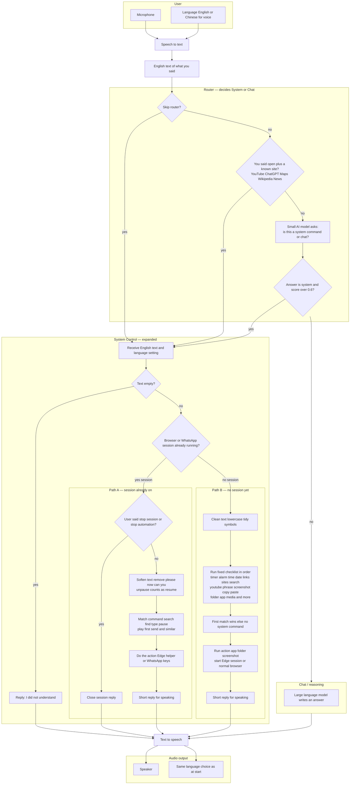
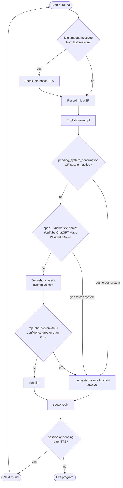
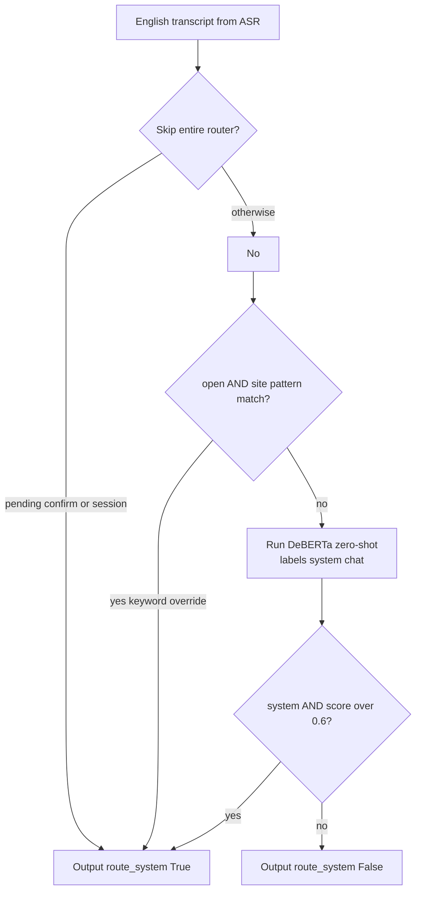
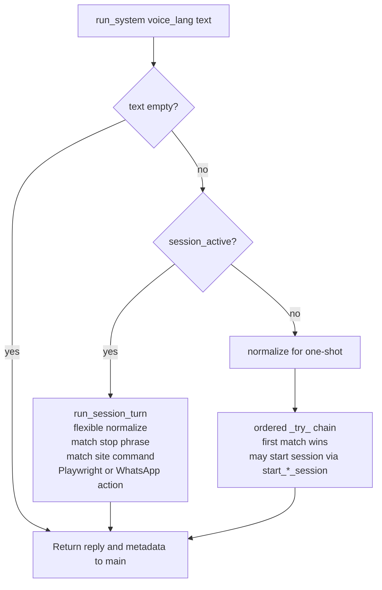

# Voice assistant flow — **System part** explained simply

This matches how the project really works (`main.py`, Router, `System/`).  
Open this file in **Markdown preview** or paste the diagram into [mermaid.live](https://mermaid.live).

**About the router score:** the program sends you to **System** when the AI label is “system” **and** the score is **above 0.6** (not 0.8). Older drawings sometimes show 0.8; the code uses **0.6**.

---

## Main picture (like your diagram, with System opened up)

Read from **top to bottom**. The **System Control** box is expanded so you can see what happens inside.

**Labels on the Router arrows (plain words)**

| Arrow | Meaning |
|--------|---------|
| **Skip router → yes** | You are already answering a “did you mean this app?” question **or** a browser/WhatsApp session is **still on**. Then the program **does not** run the small AI router and sends you **straight to System**. |
| **open plus known site → yes** | You said **open** together with a known site name. Same as above: **straight to System** without the AI router. |
| **system and score over 0.6 → yes** | The AI router thinks the line is a **system** task and is **confident enough**. |
| **Otherwise** | Goes to the **chat** model for a normal answer. |

---

## Additional flowcharts (aligned with code — thesis / report)

Use these if you need diagrams that match **exact** behaviour: the router **only chooses** System vs Chat (it does **not** parse commands). **`run_system`** is the **same** entry whether routing used **keyword override** or **DeBERTa**. A **session** starts **inside** the system layer when a `_try_*` handler calls `start_*_session`, not in the router.

### Figure A — One round of `main` (idle → listen → route → act → speak → loop or exit)

**Notes for Figure A**

- **Skip router** covers **both** “waiting for yes/no” **and** “session already on” — same forced **system** route.
- **Keyword path** is only: word **open** + regex site match in `Router/router_layer.py` — not the word “system” and not “automation” as a keyword.
- **Each round** = one recording → one transcript → one `run_system` or one LLM call (not continuous background ASR).

---

### Figure B — Router only: routing decision (no command extraction)

**Notes for Figure B**

- The router returns **only** a **route** plus scores. **Parsing** “search for …”, “open youtube”, timers, etc. happens **later** in **`system_layer`** / **`session_ops`**.

---

### Figure C — `run_system`: where command parsing happens (two modes)

**Notes for Figure C**

- **Keyword router** and **DeBERTa router** both land on **the same** `run_system` box — there is **no** separate “keyword → automation only” entry.
- **Session** begins when a **one-shot** handler successfully calls e.g. `start_youtube_session` **inside** `_dispatch` (not in the router).
- **Next** user utterance: `session_active()` is true → **`run_session_turn`** path until **stop** or **idle timeout**.

---

## What “command extraction” means here (plain words)

**Path B — no session yet**

1. **Clean the text** so the same idea with different punctuation still looks the same (lowercase, spaces fixed, most symbols removed).
2. **Pattern matching** means the program looks for phrases it knows, in a **fixed order** (for example timer before “open website”). The first pattern that fits is the one that runs.
3. **Pull out the important words** from the sentence (for example the part after “search the web for …” or “open youtube and …”).
4. If you tried to open an **unknown app name**, it may **guess** a close name and **ask you to confirm** yes or no.

**Path A — session already on**

1. **Softer cleaning** — removes filler words like “please” so “please search cats” and “search cats” behave the same.
2. **Match commands** for that mode (YouTube uses different rules than ChatGPT / Wikipedia / Maps / News). It looks for **search** plus the rest of the line, or **type** …, **pause**, **play first**, **stop**, and similar.
3. If you started from a phrase like “open YouTube for cats”, the program may first open YouTube then run an internal line like **search cats** so the matcher gets a clear command.

---

## What the System can do in this project (checklist)

| Area | What it covers |
|------|------------------|
| **Time** | Timer and alarm using the Windows Clock app (with limits on how perfect it is) |
| **Time readout** | Say the current time or date |
| **Web** | Open a normal website list, open a link you say, search Google in the browser, open the first DuckDuckGo result in some cases |
| **Screenshots** | Save a picture of the screen |
| **Media key** | Play/pause style command for the active player |
| **Clipboard** | Copy and paste shortcuts |
| **Folders** | Open Downloads Documents Desktop and similar under your user folder |
| **Apps** | Open a known desktop app from a safe list |
| **Paths** | Open a file path if it is allowed and exists |
| **Automation in Edge** | YouTube ChatGPT Wikipedia Google Maps Google News — needs Edge **already running with remote debugging**; the program **connects** to it (it does not have to start a new browser) |
| **WhatsApp** | Opens WhatsApp desktop; only simple typing and sending |

---

## After System: how voice comes out

- **System** only returns **text** to say.
- **main.py** always sends that text to **text-to-speech** in the same **round**, using the language you chose at the start.
- If a **long idle** ended the session, a **one-time message** may be spoken at the **beginning of the next round** before it listens again.

---

## Loop: when the program listens again

- If a **session** is still on or it is **waiting for your yes/no**, the app **stays in the loop** and the next recording goes **straight to System** (router skipped).
- Otherwise it often **ends** after one full round.

---

## File map (for developers)

| Part | File |
|------|------|
| Main loop | `main.py` |
| System or chat routing | `Router/router_layer.py` |
| One-shot commands and starting sessions | `System/system_layer.py` |
| Session commands and stop | `System/session_ops.py` |
| Connect to Edge | `System/browser_control.py` |
| Clicks and typing per site | `System/Automation/*.py` |
